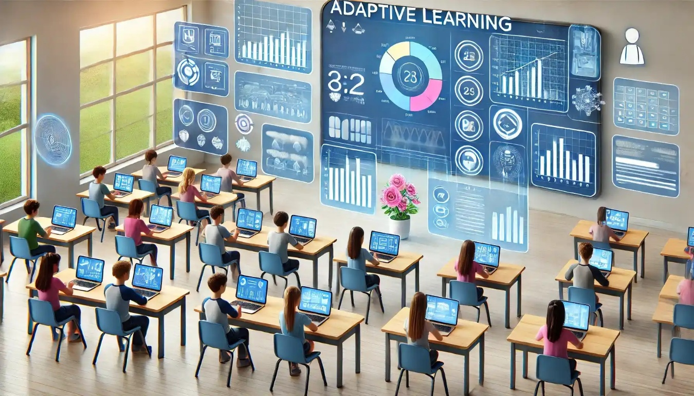
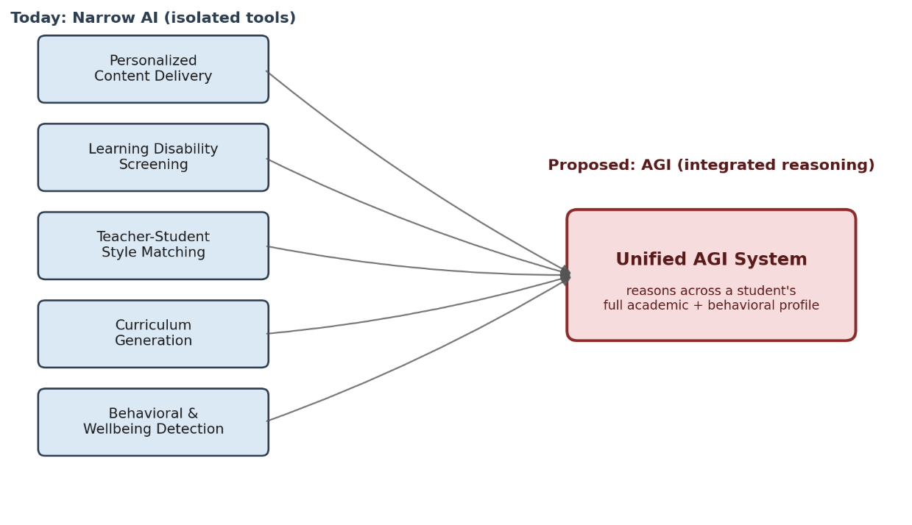

Rich Fox

ITAI 2372 – Artificial Intelligence Applications

Houston City College – Applied AI & Robotics Program

August 1, 2026

## Introduction

Artificial General Intelligence (AGI) refers to a still-theoretical form
of machine intelligence capable of understanding, learning, and
performing across a wide range of tasks and domains at a human level,
rather than being built or trained for a single narrow job (Turing,
1950). Later work has emphasized that an AGI agent should be able to
comprehend, learn, and carry out any intellectual task a person is
capable of, without being restricted to a single area of competence
(Latif et al., 2024).

This distinguishes AGI from the artificial intelligence already in wide
use today, often called artificial narrow intelligence (ANI) or narrow
AI. Narrow AI performs one function well but cannot transfer that skill
to an unrelated task without being retrained from scratch: a
fraud-detection model cannot draft a lesson plan, and a lesson-planning
tool cannot screen for a learning disability. Latif et al. (2024) frame
the distinction along three dimensions: scope (narrow and task-specific
versus broad and versatile), learning (confined to one domain versus
able to acquire and apply knowledge across domains), and adaptability
(limited to a predefined domain versus able to operate in new
environments and tasks it was not explicitly trained for).

Education is one of the industries most frequently discussed as a strong
candidate for AGI, precisely because effective teaching already requires
the kind of cross-domain reasoning AGI aims to achieve: understanding a
student's academic performance, learning style, emotional state, and
life circumstances all at once, and adjusting instruction accordingly
(Latif et al., 2024). Today's AI in education does pieces of this work
in isolation, through separate tools that do not share information with
one another. This case study examines that current narrow-AI baseline,
proposes how a unified AGI system could combine those isolated functions
into one adaptive system, and weighs the benefits against the ethical
risks such a system would introduce.

## Industry Analysis

Education technology has adopted AI unevenly but broadly, and the
pattern across every sub-area is the same: a narrow tool solves one
piece of the teaching-and-learning process well, without any connection
to the other pieces. The most mature application is personalized
learning, meaning systems that adjust content, pacing, and feedback to
an individual student's progress. This area alone has produced a large
and fast-growing research base, evidence that schools and universities
are already investing heavily in narrow AI tools even without any
unifying system connecting them.

Curriculum design and assessment are two closely related applications
that are earlier in their development but already show measurable
results. Generative AI tools have been used to draft course outlines,
design learning activities, and generate assessment items and grading
rubrics, saving teachers the time they would otherwise spend building
these materials from scratch (Latif et al., 2024). On the assessment
side, narrow AI has historically been limited to auto-scoring, producing
a numeric grade without explanation; newer generative systems can go
further by producing written, personalized feedback that explains the
reasoning behind a score, rather than the score alone (Latif et al.,
2024). Even so, these tools remain confined to the single task of
drafting content or grading a response; they do not draw on what is
known about a student's learning style, emotional state, or history with
a subject.

A second, more specialized
application is screening for learning disabilities. Machine-learning
models have been used to analyze cognitive testing data, facial
expressions, and behavioral patterns to flag students who may have
dyslexia, ADHD, or other learning differences, often earlier than
traditional referral-based methods would catch them. A related but
distinct application is behavioral and emotional monitoring, where
computer-vision and audio models track engagement, confusion, or
frustration in real time so a teacher can adjust an approach mid-lesson
(Sadegh-Zadeh et al., 2025). These systems are useful precisely because
they surface something a teacher cannot track across an entire classroom
on their own, but the information they generate typically stays within
that one tool rather than informing how the student's curriculum or
teacher assignment is handled.

A less-developed but well-documented application is teacher-student
matching. Research shows that a teacher's raw subject expertise is not
sufficient for good outcomes; how well a teacher's communication style
aligns with a given student's way of understanding the material matters
just as much, and in some cases more, since a highly aligned but less
"expert" teacher can outperform a highly accurate but poorly
aligned one (Sucholutsky et al., 2024). Despite this, students today are
still assigned to teachers primarily through scheduling logic, with no
systematic accounting for this kind of fit, and a U.S. patent filed to
address exactly this gap underscores that the problem is recognized
industry-wide but not yet solved at scale (U.S. Patent No. 11,386,368,
2022).

Across all of these areas, the same limitation holds: each tool solves
one problem using one type of data, in isolation from the others. A
personalization engine does not know what a behavioral-monitoring tool
has detected about a student's frustration; a learning-disability
screener does not feed into how a curriculum is designed for that
student; a teacher-matching algorithm has no access to a student's
emotional engagement history. This fragmentation is the central
limitation an AGI system would need to address, and it is also the
starting point for the proposal below.

## AGI Application Proposal

The AGI opportunity in education is not to invent an entirely new
capability, but to unify the narrow tools already described above into a
single system that reasons across a student's complete profile at once,
rather than treating academic performance, learning differences,
emotional state, and teacher fit as separate problems to be solved by
separate tools.

Specific use cases for this unified system include:

- Cross-domain curriculum design: rather than personalizing content
  within a single subject, an AGI system could notice that a student's
  struggle in math is actually rooted in reading comprehension, and
  adjust instruction in both subjects simultaneously.

- Early identification of learning disabilities: combining performance
  data, behavioral signals, and engagement patterns into one profile,
  rather than relying on a single screening tool applied at one point in
  time.

- Teacher-student matching: using the same student profile to recommend
  which teacher's style is the best representational fit, informed by
  ongoing performance rather than a one-time assignment (Sucholutsky et
  al., 2024).

- Behavioral and emotional monitoring: feeding real-time engagement and
  wellbeing signals back into the same system, so a dip in emotional
  wellbeing is considered alongside academic performance rather than
  flagged by a separate, disconnected tool.

Figure 1 illustrates this shift: five narrow tools operating in
isolation today, feeding into a single AGI system that reasons across
all of them at once.

## Anticipated Benefits

The clearest benefit of unification is consistency: a student's profile
would travel with them rather than resetting with every new tool,
teacher, or school year. A learning difference identified in third grade
would still inform curriculum design and teacher matching in sixth
grade, instead of requiring a fresh referral and a fresh screening
process. Latif et al. (2024) argue that AGI-driven systems could use
exactly this kind of historical and current performance data to help set
realistic, individualized educational goals, an outcome that is
difficult to achieve when each data source lives in a separate,
disconnected system.

A second benefit is efficiency for teachers. Much of what an AGI system
would automate, drafting lesson plans, generating assessment items,
summarizing a student's engagement trends, is already partially
automated today; unifying it would simply mean a teacher receives one
coherent recommendation instead of having to synthesize outputs from
four or five separate dashboards themselves (Latif et al., 2024). This
frees time for the parts of teaching that are hardest to automate:
building relationships, motivating students, and exercising professional
judgment about when a data-driven recommendation does not fit a
particular child.

## Risks and Ethical Concerns

Unifying these tools also unifies their risks. Data bias is the most
immediate concern: if the training data behind an AGI system
underrepresents certain groups of students, the system's
recommendations, whether about curriculum, disability screening, or
teacher matching, will be systematically less reliable for exactly the
students who most need individualized support (Latif et al., 2024).
Because a single AGI system would make decisions across every one of
these domains at once, a bias in one part of the profile could quietly
distort recommendations in a part of the system that looks, on the
surface, unrelated.

Privacy is the second major concern, and it becomes sharper as more
categories of data are combined into one profile. McStay (2020) shows
that even emotional AI systems that do not identify a specific
individual by name still raise real privacy concerns, since inferring a
student's emotional state is itself a sensitive act regardless of
whether the data is anonymized. Sadegh-Zadeh et al. (2025) extend this
concern directly to classrooms already piloting facial and vocal emotion
analytics, describing the same technology as capable of delivering
genuine, timely support to struggling students or of functioning as
constant, unwelcome surveillance of a child's every expression,
depending entirely on how it is governed. Because AGI in education would
necessarily draw on informed consent, since students are minors, this
concern is magnified further; parents and students would need a clear,
meaningful way to understand and consent to what is being collected and
how it is used (Latif et al., 2024).

A third concern is interpretability. Latif et al. (2024) note that as AI
systems in education grow more complex, it becomes harder for a teacher,
parent, or student to understand why a system produced a given
recommendation, which undermines trust and makes it difficult to
challenge a decision that is wrong. An AGI system making decisions
across curriculum, assessment, disability screening, and teacher
matching simultaneously would need to be explainable across all of those
domains at once, a considerably higher bar than today's narrow tools
face individually.

*Figure 1. Today's isolated narrow-AI tools in education versus a
proposed unified AGI system.*

## Conclusion

Education is a strong candidate for AGI because the underlying problem,
understanding a whole student rather than one slice of their
performance, is exactly the kind of cross-domain reasoning narrow AI
cannot do. Today's tools already prove the individual pieces work:
personalization engines, disability screeners, engagement monitors, and
early matching research all show measurable benefit on their own. What
is missing is the connective layer between them, and that is precisely
what an AGI system would supply.

That same connective layer is also where the greatest risk lives. A
system that combines academic, behavioral, and emotional data about a
student into one profile is a system that concentrates a great deal of
sensitive information in one place, and errors or bias in that profile
would touch every part of a student's education at once rather than
being contained to one narrow tool. Realizing the benefit of AGI in
education without the risk will depend less on the underlying technology
and more on the ethical guardrails, consent standards, and human
oversight built around it from the start (Sadegh-Zadeh et al., 2025).

## References

Latif, E., Mai, G., Nyaaba, M., Wu, X., Liu, N., Lu, G., Li, S., Liu,
T., & Zhai, X. (2024). AGI: Artificial general intelligence for
education. arXiv. https://arxiv.org/abs/2304.12479

McStay, A. (2020). Emotional AI, soft biometrics and the surveillance of
emotional life: An unusual consensus on privacy. Big Data & Society,
7(1). https://doi.org/10.1177/2053951720904386

Sadegh-Zadeh, S.-A., Movahhedi, T., & Bahonar, F. (2025). Emotion AI in
the classroom: Ethics of monitoring student affect through facial and
vocal analytics. AI and Ethics, 6(37).
https://doi.org/10.1007/s43681-025-00897-0

Sucholutsky, I., Collins, K. M., Malaviya, M., Jacoby, N., Liu, W.,
Sumers, T. R., Korakakis, M., Bhatt, U., Ho, M., Tenenbaum, J. B., Love,
B., Pardos, Z. A., Weller, A., & Griffiths, T. L. (2024).
Representational alignment supports effective teaching. arXiv.
https://arxiv.org/abs/2406.04302

Turing, A. M. (1950). Computing machinery and intelligence. Mind,
59(236), 433–460.

U.S. Patent No. 11,386,368 (2022). Method for matching students with
teachers to achieve optimal student outcomes.

